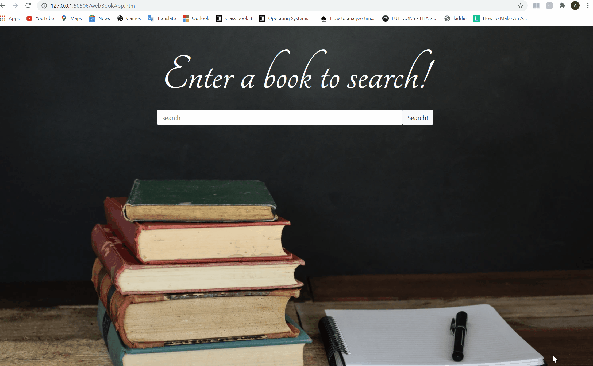

# Book-search-app
Website app designed to work with the google books API to search for books and pull up information on the book that was searched for. 

This project was a huge learning experience for me as a developer, helping me to learn HTML, CSS, and Javascript, along with Jquery, bootstrap and how these work in tandem. I also had to learn what a RESTful api was and how to incorporate it into a project.  
